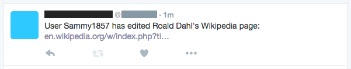
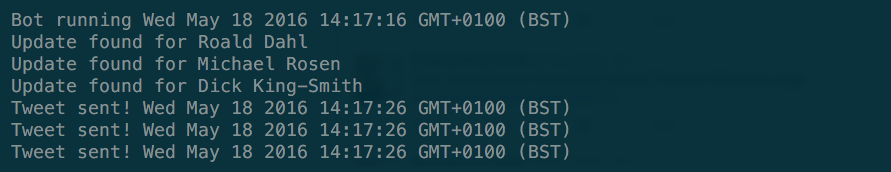

# Edit Bot
Twitter bot. Watches Wikipedia articles for edits. Tweets when articles have been revised.

## Setup

Run 'npm install' to install dependencies. ([Installing Node.js and updating npm](https://docs.npmjs.com/getting-started/installing-node))

Put your Twitter access tokens in `auth.js`. ([Obtaining access tokens](https://dev.twitter.com/oauth/overview))

~~~
module.exports = {
    consumer_key: '...',
    consumer_secret: '...',
    access_token_key: '...',
    access_token_secret: '...'
}
~~~

Edit `conf.json`. The first property is the list of articles you want to poll. The second is the polling interval in seconds.

~~~
{
    "articles": ["Roald_Dahl", "Michael_Rosen", "Dick_King-Smith"],
    "interval": 30
}
~~~

Use the article name given in the path. For example, the article name for:

~~~
https://en.wikipedia.org/wiki/E._Nesbit
~~~

Would be:

~~~
"E._Nesbit"
~~~

## Run

Run in the console.

~~~
$> node app.js
~~~

There is no log file. Messages are logged straight to the console:

## Data
The application creates a file called `data.json` and gathers the following information:

~~~
{
    name: name, // article name
    revisionCount: revisionCount, // number of revisions (since first checked)
    editors: editors, // list of names of revision editors
    dates: dates, // dates of revisions
    latestComment: comment, // latest comment
    latestURL: url, // URL of latest revision
    lastChecked: dateNow, // last time the article was checked
    latestEditor: latestEditor // name of editor of latest revision
}
~~~